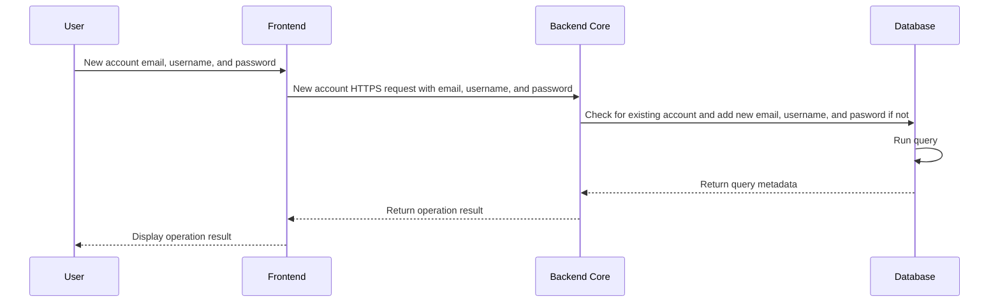
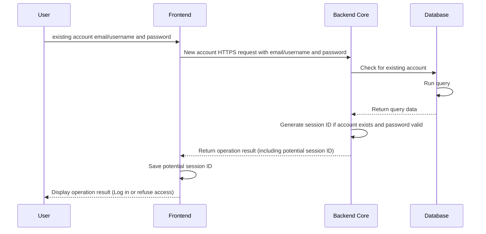
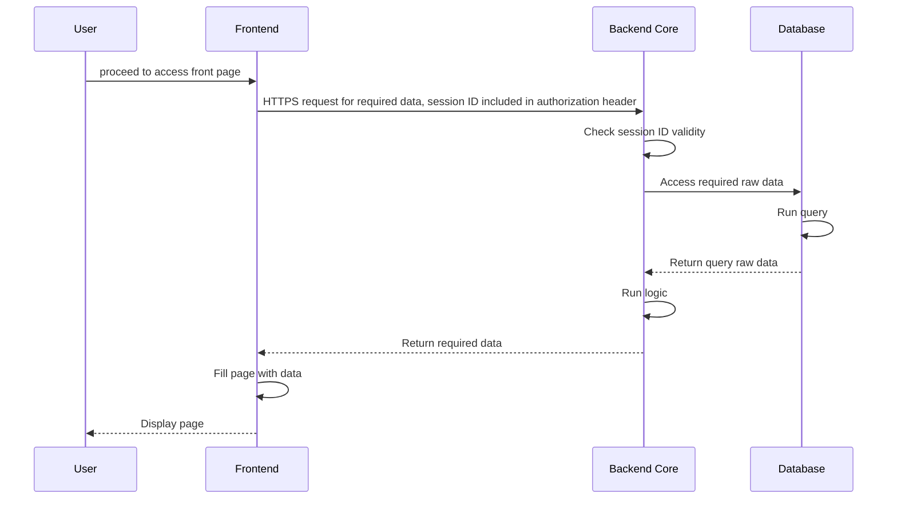
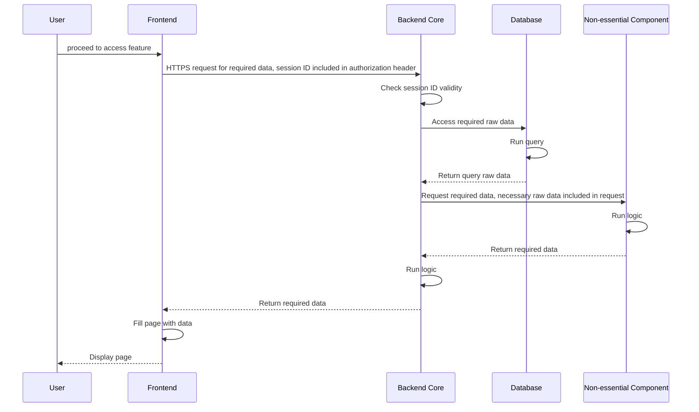

# General architecture of Clevershop web application

This document presents the general architecture of the CleverShop web application, including end-to-end flow descriptions and diagrams. Reading the technical content of this document is crucial to building a solid understanding of the application's inner workings.

## Overview

The creation of CleverShop comes with the need to develop an application with a certain set of core features along with aspirational features to come after release. As such, the program works with a microkernel-microservices hybrid architecture. 

More specifically, the backend is primarily composed of a core containing crucial application logic (e.g. grocery listing functionality), effectively powering all functional requirements expected for release. In a sense, until non-essential features are involved (e.g. smart grocery listing), the program is monolithic. The logic behind this is that modularity is not needed for these core features; if one fails, the program is not expected to run. As such, keeping one large core keeps much of the development cycle simple without sacrificing expected functionality.

Beyond the core, the backend houses multiple secondary components. Each one is to power one or more non-essential features depending on the practicality surrounding implementation. If one fails, overall functionality is to simply be downgraded, but the rest of the application, that is to say, the core and its remaining secondary components, runs as usual. Critically, these components are independent processes, allowing for maximal modularity where constant uptime is not strictly necessary. Additionally, this approach allows for easier effort divisions for the development of non-essential features; two components could be developped completely independently without conflicts or dependencies.

This is a microkernel-microservices hybrid as it merges the asymmetrical core-component relationship along with the microservices component of maintaining multiple independent processes.

The frontent is simpler in nature, consisting of a web interface that communicates with the rest of the application using API requests.

A database is connected to the backend core to access organization data.

## End-to-end flows

The following flow diagrams describe how some basic functionality is to take place within the application.

### User account creation

### User login request

### User account access (after successful login request)

### Use non-essential feature

## Related documents
- [General architecture diagram](general-architecture.svg)
- [CleverShop overview and design principles](README.md)
- [Clevershop requirements](requirements.md)